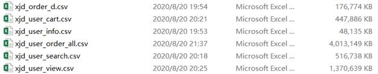
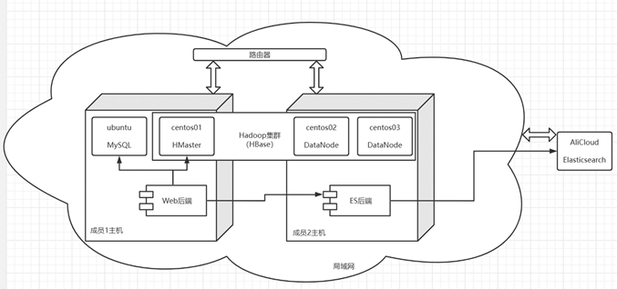
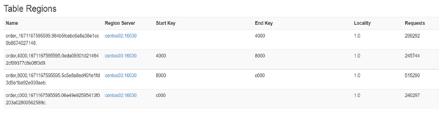

# 项目报告

## 一．  项目基本分析

### 1. 项目应用背景

随着科学技术的进步，网购已经成为人们日常生活中不可或缺的一部分，而传统的关系型数据库已不能满足随之产生的海量订单数据的存储和访问需求。而列存储数据库HBase相比于RDBMS具有更好的读写性能，其与Hadoop的天然集成也让它具有十分方便和灵活的横向扩展能力，面临大数据的挑战时显得更加得心应手，包括淘宝、滴滴和网易在内的多个互联网企业也都选择使用HBase存储订单数据。我们的项目也将利用非关系型数据HBase来完成对订单数据的管理。

### 2. 功能描述

我们将利用HBase来存储千万数量级的京东订单数据，并针对平台的普通用户的需求，完成订单查询功能，如全部查询、时间查询、关键字查询和订单状态查询；以及对订单进行更新的功能，如确认收货、取消订单、删除订单。

​    

## 二．  详细设计报告

### 1. 数据介绍

该数据来源于京东平台2020年5月-2020年8月家用电器脱敏订单数据。数据集一共6.26GB，包含六张表：包含了用户信息、购物车信息、订单信息、浏览记录等数据。最终，我们选取了其中的xjd_order_all表（用户订单）和xjd_user_info表（用户信息）来实现订单查询的功能，其中用户订单数据的文本大小在4GB左右，共有13,920,352条数据，用户信息数据量在40MB左右，共有215,091条数据。此外，我们对部分无关属性做了筛选，并添加了部分属性（如user_info的密码）以保证项目的完整性。

图表 1京东小家电数据集

### 2. 项目整体架构

图表 2 项目架构描述草图

我们通过路由器将小组成员的两台电脑主机相连接，并将两台电脑上的虚拟机都设置成桥接模式，同时将IP设置为同一个网关下的IP并设置为静态的，这样虚拟机之间就能直接互联，从而搭建起Hadoop集群（网关为192.168.43.1，Hadoop的三台虚拟机IP分别为192.168.43.29,、192.168.43.30、192。168.43.31）。其中成员1主机开一个虚拟机centos01作为Master节点(namenode)，成员2主机开两个虚拟机centos02，centos03作为Slave节点(datanode)，并在Hadoop集群上搭建HBase集群和Zookeeper集群。

我们将千万级的订单数据存储在HBase的order表中。由于user_info表的数据只有21万，访问量较小（只在用户登陆时进行一次访问），同时user信息具有较强的事务性，于是我们直接将user_info存储在成员1主机的Ubuntu虚拟机的MySQL中。此外，我们还利用Elasticsearch（后面简称ES）作为HBase的二级索引，存储了订单商品名称、品牌名称、状态信息。由于Hadoop集群、虚拟机和ES等组件都需要较多内存才能维持稳定运行，而小组成员的硬件设备有限，所以ES部分我们部署在了云端以减轻本地压力。

在网站服务器部分，我们将整个服务拆分成了Web后端和ES后端两个微服务，其中前端直接请求Web后端，Web后端可以访问MySQL数据库、HBase以及远程调用ES后端，ES后端去访问云端的ES数据并返回给Web后端。

### 3.   HBase order表RowKey的设计

我们的Rowkey设计为用户账户的哈希，拼接上用户账户，拼接上订单时间戳的倒序，拼接上订单ID，即表示为，RowKey = MD5(user_log_acct).substr(4) + user_log_acct + tsDSC + orderID。

其中，我们通过MD5(user_log_acct).substr(4)来对订单数据添加哈希值，由于Hash本身具有随机性，这样可以避免数据倾斜或局部热点问题。

tsDSC = Long.MAX_VALUE - ts(ts为订单下的下单时间转为Long类型的时间戳) 我们这样设计是因为查询最近的订单是购物平台用户的常用功能，通过这样的设计可以使最新的订单排在靠前位置，减少了查询时间。

最后，由于用户可能在一个时间点合并多个订单同时下单，所以依旧需要订单ID来更精准的确定一条订单。

综合以上三点，也就构成了我们Rowkey的设计。这样整个订单的存储特点就是：平台所有的订单都足够均匀地存储在不同的节点（Region）中，且一个用户的订单总是按照时间降序排列在一起，提高了scan订单的效率和吞吐量。

### 4.   预分区

由于我们为了使订单更加均匀地分布在Region中，我们在RowKey的左侧头部添加了哈希值（哈希值的范围是0000-ffff），所以我们在预分区时根据哈希值分为了四个区域，分别是[0000,4000), [4000,8000), [8000,c000), [c000,ffff]。通过预分区，我们很好地解决了在批量插入大量数据时负载不均衡的问题。下面是我们的数据在写入到HBase的某一时刻的分布情况。

图表 3 HBase预分区后某时刻数据插入情况

### 5.   HBase order表Column Family的设计

根据用户实际的访问场景，除了被选为Rowkey组成部分的属性，我们将订单的属性拆分成了两个列族：Brief列族和Detail列族。其中Brief列族是订单的简要信息，用于用户浏览订单的简要信息列表，而用户对于订单列表中的某一项想查看详情时，点击这一项，此时后端收到消息后会请求Detail列族的信息并返回给用户。

这样设计的主要考量是因为真实场景下订单的详情数据较多，而用户几乎不会每一条订单都查看它的详细信息，只会对少量订单进行详情查看，大多数情况下只是浏览订单的概要信息。所以我们将订单的属性进行了拆分，大量用户不感兴趣的订单详情信息就不访问、不返回，这样可以大幅减少平台的访问压力，整体提高了平台的并发访问量。

\6.   Elasticsearch索引字段的设计

我们创建ES 的order索引表作为HBase的二级索引，选择了HBase order 表的Rowkey作为order索引的id，item_name（商品名）和brandname（品牌名）经过ik分词器（ik_max_word）处理后存放为text类型。状态属性cancel_flag、finish_flag和delete_flag存放为boolean类型。user_log_acct存放为keyword类型、order_id存放为long类型。注意由于的order_id存放在Rowkey的尾部，所以无法直接通过order_id查询订单，需要在ES中利用order_id索引返回ES的id（Rowkey）再通过Rowkey查询HBase中的订单。ES不做回表查询，只根据属性进行索引返回id。

## 三．  数据访问

### 1. 全部查询

用户登陆后直接查看所有订单，向下滑动进行懒加载所有订单（用户所有的访问都是通过懒加载的形式，后面不多赘述）。rowkeyPrefix = MD5(user_log_acct).substr(4) + user_log_acct，设置startRowkey = rowkeyPrefix， endRowkey = rowkeyPrefix + Long.MAX_VALUE，limit = N，。由于HBase的Rowkey是按照字典序排列，这样设计访问就确保了在查询所有订单时，HBase能在一个用户的所有订单中的集合里面进行从上到下高效地scan，每次返回N条订单。

### 2.   时间范围查询

用户访问某一段时间内的订单，例如八月的订单。和全部查询类似，不过startRowkey设置为rowkeyPrefix + endTsDsc，endRowkey设置为rowkeyPrefix + startTsDsc。其中endTsDsc是Long.MAX_VALUE - 时间范围的右界的时间戳，右界的时间戳更大，所以被减去后值更小，作为了HBase扫描的上界，startTsDsc同理，表示Long.MAX_VALUE - 时间范围的左界的时间戳。这样就确保了在HBase在某个用户的一个时间范围内的订单集合里高效地scan，同样一次懒加载N条订单。

### 3.   关键词查询和状态查询

这两个查询都利用到了ES返回的匹配的订单的Rowkey列表，再利用HBase的批量Batch查询返回结果。除了所有订单都需匹配对应ES的user_log_acct外，关键词查询需匹配item_name或brandname，状态查询是匹配相应的flag，如查询已完成订单就是匹配finish_flag = true。此处利用到了ES的类似分页的功能，即设置from和to。

### 4.   详情查询

用户如果对某一项订单需要查看更多信息，点击此项，此时后端会访问HBase的这一项的Detail列族，将更多的属性值返回给前端，此时前端将之前就返回的Brief列表中的这一项和Detail和Rowkey的信息解析后合并的集合就是详情信息。

 

## 四．  遇到的问题与思考

我们在搭建集群的时候遇到了各种各样千奇百怪的问题，比如HBase和Hadoop、Zookeeper的版本可能在某个地方不兼容，就会导致莫名其妙的报错；本地的虚拟机的悬挂可能导致HBase的各个节点时间不一致进而导致RegionServer挂掉；虚拟机的内存不足、路由器的信号不稳定，都有可能导致集群的不稳定进而导致某个节点退出集群；节点的IP发生更改时可能由于本地集群留有地址的缓存进而导致地址不一致从而迟迟无法加入Hadoop集群……比较典型的有以下一些问题。

### 1. Datanode 无法启动：

`hadoop namenode –format`后Namenode和Datanode的VERSION文件中的ClusterID不一致，把它们修改成一致即可。

### 2. org.apache.hadoop.hbase.PleaseHoldException:

`Master is initializing`。这个异常是由Master抛出的，当Region Server被关闭并快速重新启动时，主机仍然没有处理第一实例的服务器关闭，或者当Master正在初始化并调用客户端管理操作时，或者当在仍在启动的Region Server上执行操作时。

### 3. Zookeeper不稳定

主要有以下三个原因：) 网络问题：网络连接不稳定。2) 写入压力：Zookeeper在处理大量写入请求时会变得不稳定。3) 配置问题：如果配置了不合理的超时时间，则可能会导致不稳定。

Hadoop的配置和运行上可能出问题的“坑”比较多，我们在运行时可能在各个地方从硬件到软件层面出现大大小小的问题，好在我们通过查看各个集群的日志，并查阅相关文档得以解决，感受到中文互联网的内容尤其是技术领域的可靠内容还有待丰富。

### 此外

HBase不是万能的。淘宝在2011年为了解决扩展性和存储成本问题，交易历史库整体迁移到了HBase方案，这套方案在当时很好了解决了存储成本和业务查询需求。但是在2018年，因为数据库存储的原因导致的订单排序错乱的问题，受到越来越多的投诉，给用户带来非常大的困扰，使用和在线库一样的InnoDB引擎则满足不了存储成本的要求，而使用HBase则满足不了一致性二级索引等要求。所以在2018年淘宝将HBase集群替换成了PolarDB-X集群(基于X-Engine引擎的版本)，此版本存储成本相比较于使用HBase没有上升，但是由于历史库和在线库能力相同，可以创建完全一样的索引，历史订单恢复了对订单按时间排序功能的支持，同时其读取延时也得到了保证。

## 五．  分工

partner：负责HBase和Hadoop的搭建和错误排查，和HBase的写入和查询和相关Java后端的开发，以及项目的前端开发。

me：负责整体架构的设计，HBase的表设计和数据访问的设计以及涉及ES相关功能的Java后端开发。